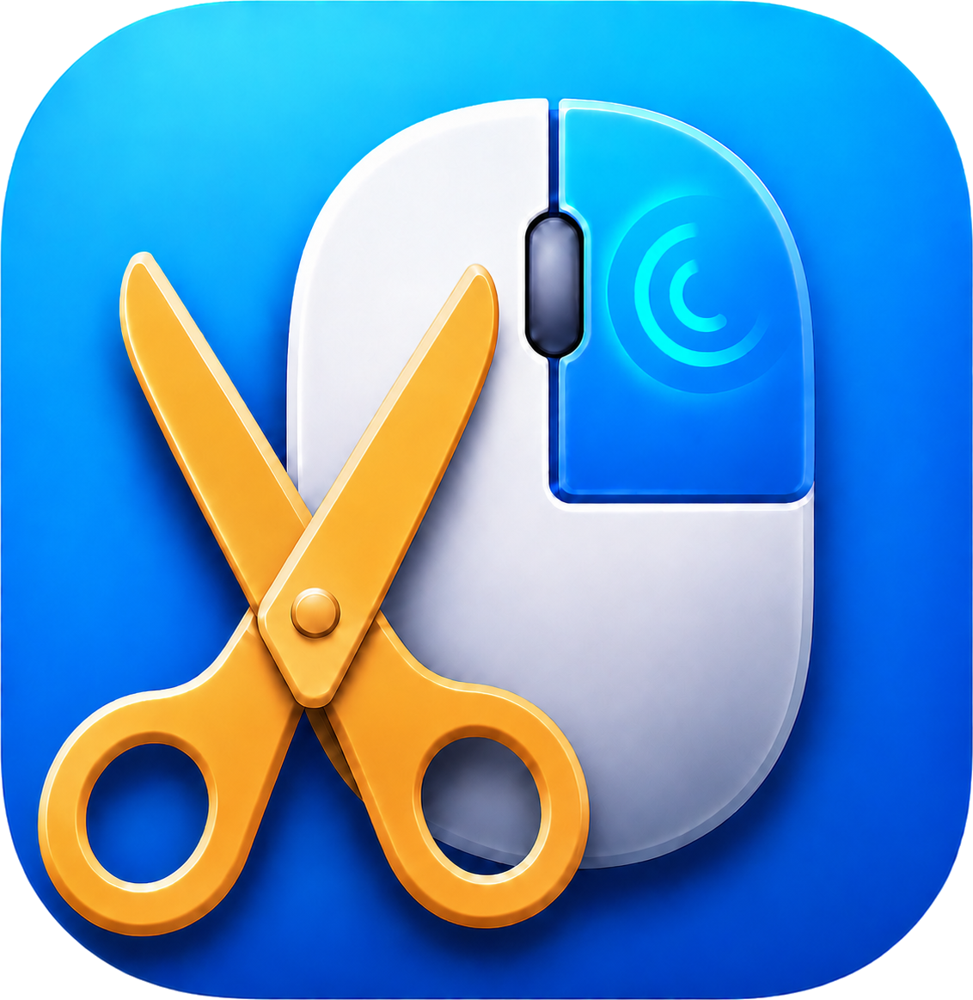
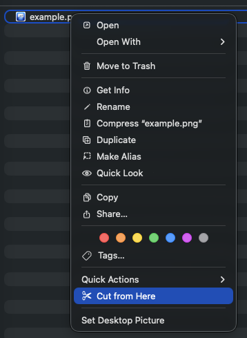
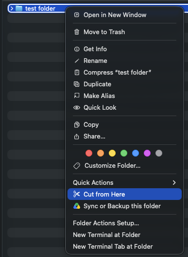
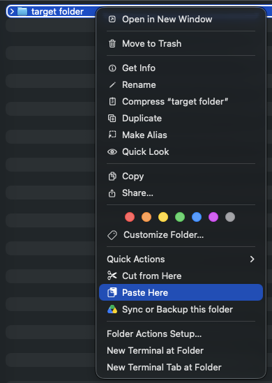

<p align="center">
  
</p>

# miCutPaste

🇹🇷 [Türkçe açıklama için tıklayın](#micutpaste-türkçe)

**Cut and paste files in Finder — the way you always wished it worked.**

miCutPaste adds two commands to Finder's right-click menu:

- ✂️ **Cut from Here** — right-click any file or folder (multiple selection supported) and mark it to be moved.
- 📋 **Paste Here** — right-click the empty area of the destination folder, *or right-click directly on a folder without entering it*, and the items are moved there.

Unlike Finder's copy-then-`⌘⌥V` dance, this is a real cut/paste workflow: the original is removed after the move.

## Screenshots

| Cut a file | Paste into the current folder |
|:---:|:---:|
|  |  |

| Cut a folder | Paste onto a folder — without entering it |
|:---:|:---:|
|  |  |

## Features

- Works everywhere in Finder, on all local folders and volumes
- Paste into a folder by right-clicking **on** it — no need to open it first
- Name collisions are resolved automatically (`file 2.txt`, `file 3.txt`, …)
- Refuses to move a folder into itself or its own subfolders
- Menu icons adapt to light/dark mode
- Localized into **33 languages** — follows your system language

## Requirements

- macOS 13 Ventura or later

## Installation

### Homebrew

```bash
brew install --cask metin-aksu/tap/micutpaste
```

Since the app is not notarized, macOS may warn you on first launch — see [the warning section](#cannot-verify-the-developer-warning) below.

If Homebrew refuses to load the tap because tap trust is required on your setup (`HOMEBREW_REQUIRE_TAP_TRUST` is set), trust it first:

```bash
brew trust --tap metin-aksu/tap
```

### Manual

1. Download the latest `.dmg` from [Releases](https://github.com/metin-aksu/miCutPaste/releases).
2. Drag **miCutPaste.app** into **Applications** and launch it once.
3. Enable the extension: **System Settings → General → Login Items & Extensions → Finder** (the app's *Open Extension Settings* button takes you there).

That's it. The extension is loaded by Finder itself — the app doesn't need to stay running, and it survives reboots.

### "Cannot verify the developer" warning

The app is code-signed but not notarized by Apple, so on first launch macOS may show a warning such as *"miCutPaste cannot be opened because Apple cannot check it for malicious software."* To clear it, remove the quarantine flag after copying the app into Applications:

```bash
xattr -dr com.apple.quarantine /Applications/miCutPaste.app
```

Then launch the app normally. Alternatively: right-click the app → **Open** → **Open**, or allow it under **System Settings → Privacy & Security**.

## Known limitation: iCloud-managed folders

If **iCloud Drive → "Desktop & Documents Folders"** syncing is enabled, Finder treats `~/Desktop` and `~/Documents` as iCloud locations, where macOS does not run Finder Sync extensions. The menu items will not appear there. This is an Apple platform restriction that affects all Finder Sync extensions; in those folders use `⌘C` + `⌘⌥V` instead, or disable the iCloud sync option.

## Building from source

The Xcode project is generated with [XcodeGen](https://github.com/yonaskolb/XcodeGen):

```bash
brew install xcodegen
xcodegen generate
xcodebuild -project miCutPaste.xcodeproj -scheme miCutPaste -configuration Release build
```

Code signing uses the `Developer ID Application` identity configured in [project.yml](project.yml) — point `DEVELOPMENT_TEAM` at your own team to build locally.

### Project layout

```
project.yml           XcodeGen project definition
App/                  Container app (onboarding window)
FinderExtension/      Finder Sync extension (the actual cut/paste logic)
  <lang>.lproj/       Localizations (33 languages)
icon.png              App icon source image
```

### How it works

The extension is a [Finder Sync](https://developer.apple.com/documentation/findersync) app extension that watches the file system and contributes context-menu items. "Cut" stores the selected paths; "Paste" moves them with `FileManager.moveItem`. The extension is sandboxed (required for Finder Sync) with a file-access exception entitlement — see the note in [project.yml](project.yml) if you plan to distribute through the Mac App Store.

## License

MIT © Metin Aksu

---

# miCutPaste (Türkçe)

**Finder'da dosyaları kes ve yapıştır — hep olmasını istediğiniz gibi.**

miCutPaste, Finder'ın sağ tık menüsüne iki komut ekler:

- ✂️ **Buradan Kes** — herhangi bir dosyaya veya klasöre sağ tıklayın (çoklu seçim desteklenir) ve taşınmak üzere işaretleyin.
- 📋 **Buraya Yapıştır** — hedef klasörde boş alana sağ tıklayın *veya klasöre girmeden doğrudan üzerine sağ tıklayın*; öğeler oraya taşınır.

Finder'ın kopyala-sonra-`⌘⌥V` yönteminin aksine bu gerçek bir kes/yapıştır akışıdır: taşıma sonrasında özgün dosya eski yerinden kaldırılır.

## Ekran görüntüleri

| Dosya kesme | Bulunulan klasöre yapıştırma |
|:---:|:---:|
|  |  |

| Klasör kesme | Klasöre girmeden üzerine yapıştırma |
|:---:|:---:|
|  |  |

## Özellikler

- Finder'da her yerde, tüm yerel klasör ve disklerde çalışır
- Klasörün **üzerine** sağ tıklayarak içine yapıştırma — önce açmanız gerekmez
- İsim çakışmaları otomatik çözülür (`dosya 2.txt`, `dosya 3.txt`, …)
- Bir klasörü kendi içine veya alt klasörüne taşımayı reddeder
- Menü ikonları açık/koyu moda uyum sağlar
- **33 dile** çevrildi — sistem dilinizi izler

## Gereksinimler

- macOS 13 Ventura veya üzeri

## Kurulum

### Homebrew

```bash
brew install --cask metin-aksu/tap/micutpaste
```

Uygulama notarize edilmediği için macOS ilk açılışta uyarı gösterebilir — aşağıdaki [uyarı bölümüne](#geliştirici-doğrulanamıyor-uyarısı) bakın.

Kurulumunuzda tap güveni zorunluysa (`HOMEBREW_REQUIRE_TAP_TRUST` ayarlıysa) ve Homebrew tap'i yüklemeyi reddederse, önce tap'i güvenilir olarak işaretleyin:

```bash
brew trust --tap metin-aksu/tap
```

### Elle kurulum

1. [Releases](https://github.com/metin-aksu/miCutPaste/releases) sayfasından en son `.dmg` dosyasını indirin.
2. **miCutPaste.app**'i **Applications** klasörüne sürükleyin ve bir kez çalıştırın.
3. Eklentiyi etkinleştirin: **Sistem Ayarları → Genel → Oturum Açma Öğeleri ve Uzantılar → Finder** (uygulamadaki *Uzantı Ayarlarını Aç* düğmesi sizi oraya götürür).

Hepsi bu. Eklentiyi Finder'ın kendisi yükler — uygulamanın açık kalmasına gerek yoktur ve yeniden başlatmalardan etkilenmez.

### "Geliştirici doğrulanamıyor" uyarısı

Uygulama kod imzalıdır ancak Apple tarafından notarize edilmemiştir; bu yüzden ilk açılışta macOS *"miCutPaste açılamıyor çünkü Apple onu kötü amaçlı yazılım açısından denetleyemiyor."* benzeri bir uyarı gösterebilir. Uyarıyı kaldırmak için uygulamayı Applications klasörüne kopyaladıktan sonra karantina işaretini silin:

```bash
xattr -dr com.apple.quarantine /Applications/miCutPaste.app
```

Ardından uygulamayı normal şekilde açın. Alternatif olarak: uygulamaya sağ tıklayıp **Aç** → **Aç** deyin veya **Sistem Ayarları → Gizlilik ve Güvenlik** bölümünden izin verin.

## Bilinen kısıt: iCloud tarafından yönetilen klasörler

**iCloud Drive → "Masaüstü ve Belgeler Klasörleri"** eşitlemesi açıksa Finder, `~/Desktop` ve `~/Documents` klasörlerini iCloud konumu olarak ele alır ve macOS bu konumlarda Finder Sync eklentilerini çalıştırmaz; menü öğeleri orada görünmez. Bu, tüm Finder Sync eklentilerini etkileyen bir Apple platform kısıtıdır. O klasörlerde `⌘C` + `⌘⌥V` kullanabilir veya iCloud eşitleme seçeneğini kapatabilirsiniz.

## Kaynaktan derleme

Xcode projesi [XcodeGen](https://github.com/yonaskolb/XcodeGen) ile üretilir:

```bash
brew install xcodegen
xcodegen generate
xcodebuild -project miCutPaste.xcodeproj -scheme miCutPaste -configuration Release build
```

Kod imzalama, [project.yml](project.yml) içinde yapılandırılan `Developer ID Application` kimliğini kullanır — yerelde derlemek için `DEVELOPMENT_TEAM` değerini kendi takımınıza yönlendirin.

## Lisans

MIT © Metin Aksu
